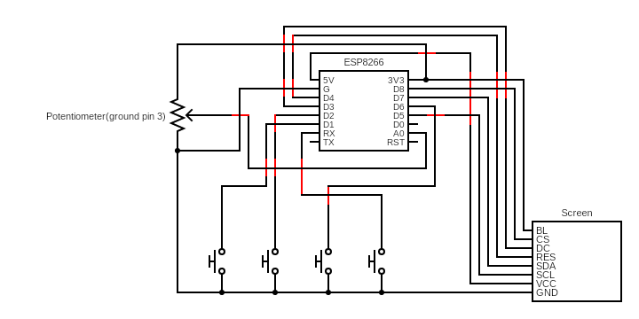

# Spotify Controller

This is the code to go along with a youtube video you can watch [here](https://youtu.be/SWiPIBWvgIU).

This code is for a device that will control spotify using their web api.

# Special Thanks

Thank you so much to Thomas Evans for putting together a wiring diagram and notes to help with the build as well as a 3d model for the finished device.

# Wiring Diagram

# Build notes

Check out the [extras/Notes.txt](extras/Notes.txt) file

## Required libraries (available from Sketch>Include Library>Manage Libraries In the arduino IDE)
TFT_eSPI

TJpg_Decoder

ArduinoJson

# StepByStep setup
0. Make sure that you have arduino IDE installed.
1. Download the code package for the Spotify Buddy from https://gitlab.com/makeitforless/spotify_controller.
2. Make a folder named spotify_buddy and extract the code zip into that folder.
3. Open the spotify_buddy.ino file in arduino IDE.

## Adjusting TFT_eSPI
1. In arduino IDE add TFT_eSPI, TJpg_Decoder, and ArduinoJson libraries.
2. In a windows explorer navigate to "Documents\Arduino\libraries\TFT_eSPI" and edit User_Setup_Select.h.
	2a. For MacOS navigate in Finder to ~/Documents/Arduino/libraries/TFT_eSPI.
3. Comment the default library adding "//" in front of the #, then uncomment #include <User_Setups/Setup2_ST7735.h>. Save and exit.
4. Now navigate to "Documents\Arduino\libraries\TFT_eSPI\User_Setups" and edit Setup2_ST7735.h.
5. Replace "#define ST7735_REDTAB" with "#define ST7735_GREENTAB" this identifier could differ depending on the display used. Save and exit.

## Setting up Spotify Developer app and pushing code
1. Go to https://developer.spotify.com/documentation/web-api and follow the instructions there to create an app.
2. When asked for a callback URI you can enter a temporary URI of 1.1.1.1 which will be replaced once your Spotify Buddy is launched for the first time.
3. In the Spotify app there are client_ID as well as client_Secret, copy these to line 62 and 63 in the spotify_buddy.ino.
4. In the spotify_buddy.ino file edit lines 58 and 59 to your WIFI_SSID and PASSWORD. Note, SSIDs are case sensitive.
5. Plug in your assembled spotify buddy and in Arduino IDE select the port and board used.
	5a. You may need to include an additional boards manager URL in arduino IDE.
	5b. Go to file, preferences and at the bottom of the popup add "http://arduino.esp8266.com/stable/package_esp8266com_index.json"
6. In arduino IDE on the top bar go to tools, cpu frequency and select 160 MHz.
7. Push the code to your spotify buddy by clicking the arrow in the top left.
8. Once the spotify buddy has rebooted it will display its' personal IP. In arduino IDE edit line 64 and replace "YOUR_ESP_IP" with the displayed IP.
9. Now go to https://developer.spotify.com/dashboard select your app and edit the callback URI to be the same as line 64 of the spotify buddy code.
10. Push the code once more in arduino IDE and once your spotify buddy reboots navigate in a web browser to the IP displayed and follow the instructions.
11. Enjoy your spotify buddy!

